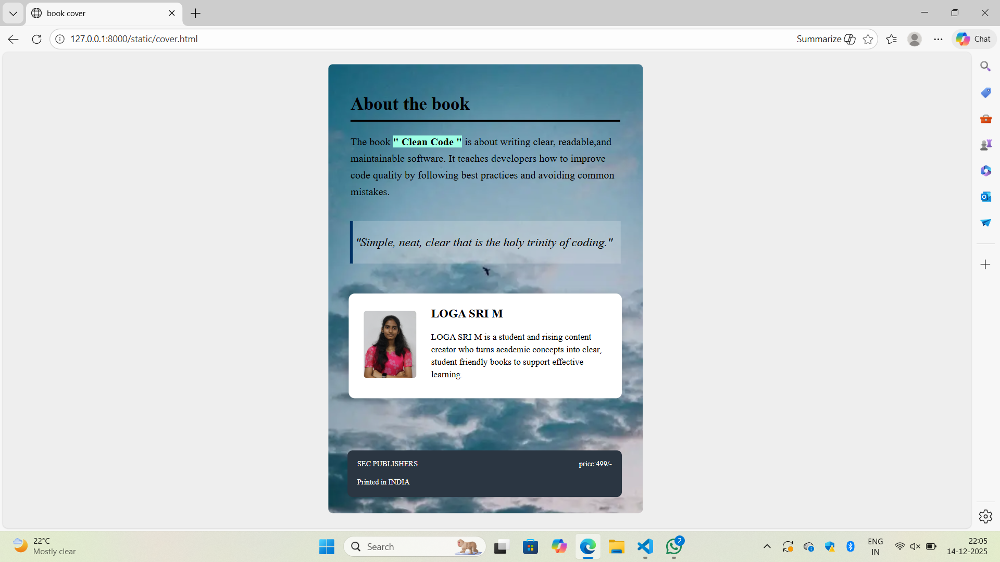

# Ex.05 Book Cover Page Design
## Date:14/11/2025

## AIM:
To design a book back cover page using HTML and CSS.

## DESIGN STEPS:

### Step 1:
Create a Django Admin project.

### Step 2:
Create an app in the Django interface.

### Step 3:
Create a folder named 'static' in the app folder.

### Step 4:
Create a new HTML file in the static folder.

### Step 5:
Write the HTML code with relevant CSS properties.

### Step 6:
Choose the appropriate style and color scheme.

### Step 7:
Insert the images in their appropriate places.

### Step 8:
Publish the website in the LocalHost.

## PROGRAM:

```

cover.html

<html>
    <head>
        <title>book cover</title>
        <link href="cover.css" rel="stylesheet">
    </head>
    <body >
    <div class="cover">
        <div class="container">
        <h2>About the book</h2>
        <hr class="line">
        <p class="description">The book <span class="high"> " Clean Code "</span> is about writing clear, readable,and maintainable software. It teaches developers how to improve code quality by following best practices and avoiding common mistakes.
        </p>
        </div>
        <div class="q-box">
            <p>"Simple, neat, clear that is the holy trinity of coding."</p>
        </div>
        <div class="authorpic">
            
            <div class="authordata">
                <h4 class="authorname">LOGA SRI M</h4>
                <p class="author-bio">
                LOGA SRI M is a student and rising content creator who turns academic concepts into clear, student friendly books to support effective learning.
                </p>
            </div>
        </div>
        <div class="footer">
            <span> SEC PUBLISHERS <br><br> Printed in INDIA</span>
            <span>price:499/-</span>
        </div>
    </div>
    </body>
</html>

cover.css

body {
    margin: 0;
    display: flex;
    justify-content: center;
    align-items: center;
    height: 100vh;
    background: #eee;
}
.cover {
    width: 420px;
    height: 600px;
    background: url("bg.png") no-repeat center/cover;
    position: relative;
    border-radius: 6px;
    overflow: hidden;
}
.container {
    position: absolute;
    top: 0%;
    left: 0;
    right: 0;
    padding: 20px 30px;
    color: #000;
}
.container h2 {
    margin-bottom: 5px;
}
.line {
    width: 100%;
    height: 2px;
    background: #000;
    border: none;
    margin-bottom: 15px;
}
.description {
    font-size: 14px;
    line-height: 1.6;
}
.high{
    background-color: rgb(158, 255, 229);
    width:4px;
    font-weight: bold;
}
.q-box{
    background:rgba(255,255,255,0.2);
    padding: 3px;
    border-left: 4px solid #003366;
    font-style:italic;
    margin-bottom: 25px;
    margin-top:50%;
    margin-left:7%;
    margin-right:7%;
}
.authorpic {
    width: 325px;
    height:100px;
    background-color: #ffffff;
    padding: 20px;
    border-radius: 8px;
    box-shadow: 0 0 10px rgba(0,0,0,0.15);
    margin: 40px auto;
    font-family: "Times New Roman", serif;
    display: flex;          /* NEW */
    align-items: flex-start;/* NEW */
}
.authordata{
    margin-bottom:50%;
    margin left:20%;
}

.author-photo {
    width: 80px;
    height: 90px;
    object-fit: cover;
    border-radius: 4px;
    margin-right: 20px;   
    margin-top:1%;       
}
.authorname
{
    margin-top:-1%;
}

.author-bio {
    font-size: 12px;
    line-height: 1.4;
    margin-right:5;
    margin-bottom : 40% ;
    margin-top:-3%;
}
.footer {
    width: 340px;
    margin-top: 70px;
    margin-left:26px;
    background-color: #2b3642;
    color:white;
    padding: 13px;
    display: flex;
    justify-content: space-between;
    border-radius: 7px;
    font-size:10px;
}

```
## OUTPUT:



## RESULT:
The program for designing book back cover page using HTML and CSS is completed successfully.
